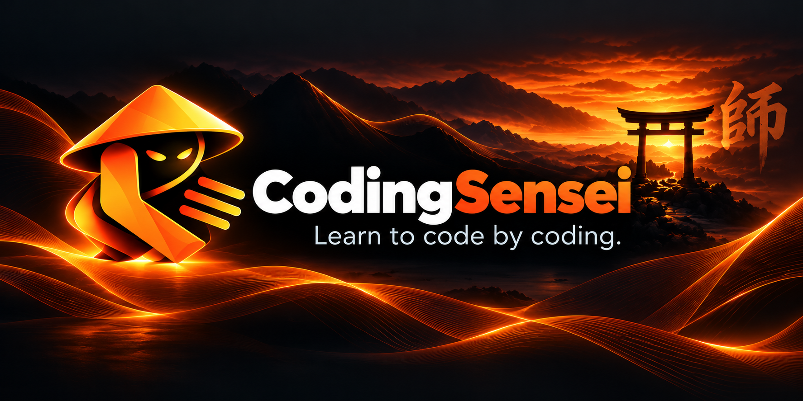
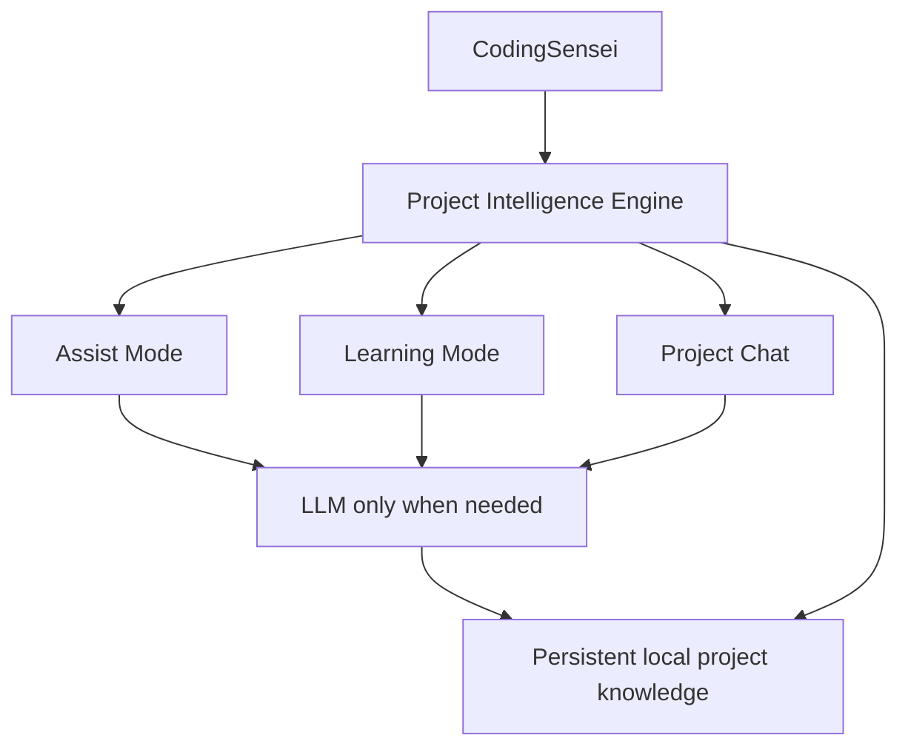

<p align="center">
  
</p>

# CodingSensei

**Learn to code by coding.**

CodingSensei is an open-source, local-first VS Code coding companion built around a shared understanding of your real project.

It is designed to work in three complementary ways:

- **Assist Mode** helps you complete, fix, refactor and test code using project context.
- **Learning Mode** teaches instead of immediately taking over, using explanations, next-step guidance and progressive hints.
- **Project Chat** lets you ask questions about the actual codebase, architecture, tests, Git changes and where work belongs.

All three are intended to use the same **Project Intelligence Engine**, so CodingSensei can understand the project once and reuse that understanding instead of treating every request as an isolated prompt.

> CodingSensei is not intended to be just another nearby-text autocomplete tool, and it is not only a learning extension. The goal is a project-aware coding system that can help you do the work, teach you while you work, or answer questions about the project.

## Current Status

The current release is **v0.3.0 — Language & Framework Intelligence**.

Implemented foundations include:

- VS Code extension foundation and CodingSensei Activity Bar.
- Learning Mode for the active workspace and editor.
- Current workspace, file, selection and diagnostics context.
- Cached deterministic project intelligence.
- Nested-project discovery and project-root resolution.
- JavaScript/TypeScript, Python and Java ecosystem foundations.
- Package/build-tool and project metadata awareness.
- Source/test relationship suggestions.
- Optional local Git branch/change-state awareness.
- Native-first symbol, definition and reference analysis using VS Code providers when available.
- Deterministic fallback parsing for supported code-structure signals.
- Evidence-based React, Express, Django and Spring Boot detection.
- Deterministic next-step suggestions and progressive hints.
- Local-first behavior with no telemetry, cloud API, account or required model server.

The broader **V1 scope below is the product target, not a claim that every item is already implemented**.

## V1 Product Scope

### Assist Mode

Project-aware coding assistance that uses actual repository structure and conventions rather than relying mainly on nearby text.

Planned V1 capabilities include project-aware autocomplete, multi-line/function completion, TODO completion, import suggestions, error fixes, refactoring suggestions, test generation and project-aware next-step suggestions.

### Learning Mode

Learning Mode uses the same project understanding as Assist Mode but changes the behavior from “complete this for me” to “help me understand and do it.”

Planned V1 behavior includes explanations, next-step guidance, progressive hints, stronger hints when needed, pseudocode before full solutions, “Why?” explanations, suggestions for which file/function to inspect next, and architecture-aware guidance when the current work is inconsistent with the project.

### Project Chat

A project-specific chat grounded in the current codebase.

It is intended to answer questions such as:

- Where is this handled?
- How does this feature work?
- Why is this failing?
- Where should a new feature belong?
- What tests cover this?
- What changed in Git?
- How does this part of the architecture fit together?

Chat can behave in an **Assist** style when the user wants proposed changes, or a **Learning** style when the user wants guidance rather than the answer immediately.

Planned scopes include **Current Project**, **Current File**, **Current Selection**, **Git Changes**, and relevant current-function/cursor context.

### Shared Project Intelligence Engine

The Project Intelligence Engine is the common foundation beneath Assist Mode, Learning Mode and Project Chat.

V1 is intended to build and maintain knowledge about:

- files and project structure
- syntax/AST or equivalent structural analysis
- symbols, functions, classes, types and interfaces
- imports, references and call relationships
- dependency and test relationships
- project architecture patterns and feature clusters
- Git state, TODOs and compiler/LSP diagnostics
- relevant-file retrieval
- semantic search where meaning matters
- structural search where exact relationships are more reliable

### Persistent Project Knowledge

CodingSensei is designed to remember what it has already learned about a project instead of fully relearning the repository on every restart.

The V1 target includes persistent local project knowledge, incremental updates for changed files, survival across VS Code restarts/PC reboots/model unloads, and a stable local project identity that can continue to recognize a project after a folder rename or move where possible.

A small `.codingsensei` metadata folder can hold the stable project identity while large indexes remain outside the repository in CodingSensei local storage.

### Background Intelligence and Incremental Indexing

The intelligence engine is intended to update project knowledge in the background without competing with active typing.

The V1 design includes:

- initial full indexing followed by changed-file updates
- file hash/Git/mtime-style change detection
- idle-time relationship and architecture analysis
- pre-computation of likely relevant context
- throttling or pausing background work when the user becomes active
- controls to view, rebuild, clear or remove stored project intelligence

### Deterministic + LLM Hybrid

CodingSensei should not use an LLM for tasks that deterministic tooling can answer exactly.

Deterministic project intelligence should handle definitions, references, imports, test relationships, dependency relationships, Git changes, diagnostics and file lookup. The LLM is reserved for work that benefits from reasoning: explanations, teaching, code generation, debugging reasoning, refactoring decisions and architectural reasoning.

The project intelligence remains available even when the model is unloaded. The V1 design can allow the LLM to sleep after inactivity and release VRAM, with resource profiles such as **Eco**, **Balanced** and **Performance** considered for later implementation.

## Architecture Direction



The core idea is simple: **understand the project once, reuse that understanding everywhere, and invoke the LLM only when reasoning or generation is actually useful.**

## Evidence-Aware Answers

Project Chat and other reasoning features should prefer verifiable project evidence over unsupported conversational claims.

The target experience is to show real file references, ideally with file + line locations that can be clicked to open the relevant place in VS Code.

Live context can include the current file, cursor/function, selected code, recent edits, diagnostics, recent Git changes, related tests, nearby symbols and relevant project relationships.

## Post-V1

Already planned but intentionally outside the first release scope:

- **Guided Project Mode** — curated projects with requirements, designs, architecture, milestones, acceptance criteria, tests and progressive guidance.
- **Challenge Mode** — focused programming, debugging, refactoring and testing exercises with progressive hints.
- **Learning Profile / Skill Progression** — track demonstrated concepts, identify weak areas, recommend future work and personalize guidance difficulty.

See [docs/ROADMAP.md](docs/ROADMAP.md) for the detailed roadmap.

## Local-First Privacy

CodingSensei currently does not include telemetry, analytics, cloud APIs, authentication, API keys, model downloads or hidden background communication. Code and project context stay inside VS Code.

Future optional intelligence providers must not become required for the core extension to work.

## Supported Language Foundations

The current foundations cover:

- JavaScript
- TypeScript
- Python
- Java

Phase 2 adds native-first symbol, definition and reference awareness plus deterministic framework signals for common React, Express, Django and Spring Boot patterns. Deeper AST/Tree-sitter analysis remains a future implementation choice where it provides clear value.

## Project Intelligence Today

CodingSensei starts from the VS Code workspace folder containing the active file and resolves the active software project by walking upward to strong project markers such as `package.json`, `pyproject.toml`, `pom.xml` or `build.gradle`. The nearest strong marker wins, so nested projects can be understood independently.

Project analysis keeps a structural index cached per resolved project root. Fast editor events reuse cached project data rather than rescanning the project or refreshing Git. Relevant file changes invalidate the affected project context.

CodingSensei discovers critical metadata separately from the bounded source scan and does not automatically run package scripts, tests, builds, hooks or project code.

## Development Setup

Prerequisites:

- Node.js 22.21.0, matching [.node-version](.node-version).
- pnpm 11.19.0, matching the `packageManager` field in [package.json](package.json).

Install dependencies:

```bash
pnpm install
```

Run the complete validation suite:

```bash
pnpm check
```

Launch the extension by opening the repository in VS Code, pressing **F5**, and choosing `Run CodingSensei Extension`.

## Commands

- `CodingSensei: Open Learning Mode`
- `CodingSensei: Refresh Learning Context`
- `CodingSensei: Show Next Hint`
- `CodingSensei: Reset Hints`

## Versioning and Releases

CodingSensei follows Semantic Versioning. The current release is `0.3.0`, representing Phase 2 — Language & Framework Intelligence.

See [CHANGELOG.md](CHANGELOG.md) for milestone history and [docs/RELEASING.md](docs/RELEASING.md) for the release process.

## Project Status

CodingSensei is still under active development and is not yet published to the VS Code Marketplace.

## License

CodingSensei is licensed under the Apache License 2.0. See [LICENSE](LICENSE).
