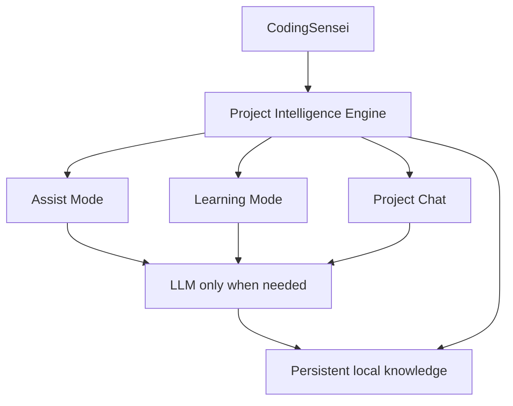

# CodingSensei Roadmap

This roadmap separates **implemented milestones**, the **V1 product target**, and ideas that are deliberately **post-V1**.

## Released Foundations

### Phase 0 — Extension Foundation (`0.1.0`)

Complete. Established the VS Code extension foundation, local-first Learning Mode, active editor context, deterministic guidance, progressive hints, supported language foundations, tests, documentation and CI.

### Phase 1 — Deterministic Project Intelligence (`0.2.0`)

Complete. Added project-root discovery, cached local project intelligence, ecosystem/tool detection, source/test relationships, bounded project scanning, optional Git state and project-aware next-step guidance.

### Phase 2 — Language & Framework Intelligence (`0.3.0`)

Complete. Added native-first active-file symbol awareness, bounded definition/reference relationships, deterministic fallback parsing, resolved local code relationships and evidence-based framework signals for React, Express, Django and Spring Boot.

### Phase 3 — Persistent Project Intelligence (`0.4.0`)

In progress. The first checkpoint establishes a versioned stable project identity in `.codingsensei/project.json` plus project-specific local extension storage. Later checkpoints add persistent file/symbol records, incremental indexing, background updates and intelligence-management commands.

---

# V1 Target Scope

V1 is built around one shared principle:

> CodingSensei should understand the project once, then reuse that understanding across Assist Mode, Learning Mode and Project Chat.

## Assist Mode

Planned V1 capabilities:

- Project-aware autocomplete.
- Multi-line and function completion.
- TODO completion.
- Import suggestions.
- Error fixes.
- Refactoring suggestions.
- Test generation.
- Project-aware next-step suggestions.
- Uses real project structure and conventions instead of relying mainly on nearby-text prediction.

## Learning Mode

Planned V1 capabilities:

- Teaches instead of immediately completing the work.
- Explains what the user is doing.
- Gives next-step guidance.
- Progressive hints.
- Stronger hints when needed.
- Pseudocode before full solutions.
- “Why?” explanations.
- Suggests which file/function to inspect next.
- Can point out inconsistencies with the project architecture.
- Uses the same underlying project understanding as Assist Mode.

## Shared Project Intelligence Engine

Planned V1 capabilities:

- File indexing.
- AST / syntax-tree analysis where useful.
- Symbol extraction.
- Functions, classes, types and interfaces.
- Import relationships.
- Reference relationships.
- Call graph.
- Dependency graph.
- Test relationships.
- Project architecture patterns.
- Feature clustering.
- Git awareness.
- TODO awareness.
- Compiler/LSP diagnostics.
- Relevant-file retrieval.
- Semantic search where useful.
- Structural search where exact relationships are more reliable.

## Persistent Project Knowledge

Planned V1 behavior:

- CodingSensei remembers what it learned about a project.
- Does not need to fully relearn the repository after every restart.
- Incremental updates only for changed files.
- Survives VS Code restart.
- Survives PC reboot.
- Survives model unload.
- Can survive project folder rename/move through a stable project ID.
- Repository fingerprint fallback may be used if the stable project ID is lost.

## Local Project Identity

Planned V1 design:

- Small `.codingsensei` metadata folder inside the project.
- Stable project ID.
- Large intelligence data stored outside the repository in CodingSensei local storage.
- Keeps the repository clean.
- Avoids storing large indexes inside Git.

## Background Project Intelligence

Planned V1 behavior:

- Watches project changes.
- Updates indexes during idle time.
- Builds deeper relationships while the user is not actively typing.
- Updates architecture understanding.
- Prepares relevant context before completion/chat requests.
- Background work is throttled or paused when the user resumes typing.

## LLM Sleep / VRAM Management

Planned V1 direction:

- Project intelligence remains available even when the LLM is unloaded.
- LLM wakes only when reasoning or generation is needed.
- Model can unload after inactivity.
- VRAM is released when the model sleeps.
- Deterministic project analysis continues without the large model.
- Resource profiles such as Eco / Balanced / Performance may control this behavior.

## Deterministic + LLM Hybrid Architecture

CodingSensei should not use an LLM for everything.

Deterministic project tooling should handle exact tasks such as:

- definitions
- references
- imports
- test relationships
- dependency relationships
- Git changes
- file lookup
- diagnostics

The LLM should be reserved for:

- reasoning
- explanations
- code generation
- teaching
- architectural decisions
- debugging reasoning
- refactoring decisions

## Project Chat

Planned V1 capabilities:

- Chat grounded specifically in the current project.
- Answers questions about the actual codebase.
- Explains architecture.
- Answers “where is this handled?”
- Explains bugs.
- Suggests where new features belong.
- Analyzes tests.
- Discusses Git changes.
- Can generate or propose changes in Assist Mode.
- Can teach instead of giving answers in Learning Mode.

## Project Chat Scopes

Planned scopes:

- Current Project.
- Current File.
- Current Selection.
- Git Changes.
- Current function/cursor context where useful.

## Evidence-Aware Answers

Target behavior:

- Chat references real files.
- Preferably includes file + line references.
- Clicking a reference should open the relevant location in VS Code.
- Answers should be verifiable instead of purely conversational.

## Live Editor Context

Context that may be used:

- Current open file.
- Current cursor/function.
- Selected code.
- Recent edits.
- Diagnostics.
- Recent Git changes.
- Related tests.
- Nearby symbols.
- Relevant project relationships.

## Incremental Indexing

Planned behavior:

- Full project scan only when necessary initially.
- Later scans process changed files.
- Uses file hashes, Git state and/or mtime-style checks.
- Avoids repeatedly scanning thousands of unchanged files.

## Project Intelligence Storage Management

Planned user controls:

- View indexed projects.
- Show index size.
- Show number of files/symbols.
- Rebuild intelligence.
- Clear cached intelligence.
- Delete intelligence for old projects.

---

# Architecture Direction

The intended architecture keeps deterministic project understanding independent from the LLM so exact project knowledge remains available even when the model is sleeping or unloaded.

---

# Post-V1 — Explicitly Out of Scope for V1

## Guided Project Mode

- Preloaded projects learners can build themselves.
- Example projects such as calculator, todo app, REST API and chat app.
- Provided requirements.
- Architecture.
- Designs/wireframes.
- Milestones.
- Acceptance criteria.
- Tests.
- Hints.
- CodingSensei guides the learner rather than immediately building everything.

## Challenge Mode

Potential challenge areas:

- Variables.
- Conditions.
- Loops.
- Functions.
- Arrays/lists.
- Maps/dictionaries.
- OOP.
- Recursion.
- Error handling.
- File handling.
- APIs.
- SQL.
- Async programming.
- Algorithms.
- Debugging.
- Refactoring.
- Testing.
- Progressive hints.
- Debugging-specific challenge formats.

## Learning Profile / Skill Progression

Longer-term goals:

- Track concepts the learner demonstrates.
- Identify weak areas.
- Recommend future projects/challenges.
- Show demonstrated skills after completing work.
- Personalize future difficulty and guidance.

---

# Product Principle

CodingSensei is **not just an autocomplete extension and not just a learning extension**.

It is a project-aware coding system that can:

- help you do the work,
- teach you while you work,
- or let you ask questions about the project,

while reusing the same persistent understanding of the codebase.
